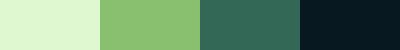
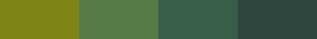
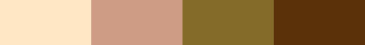
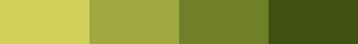
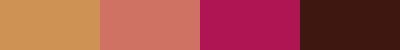
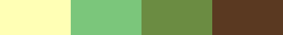
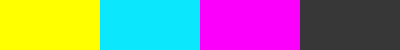
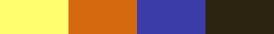
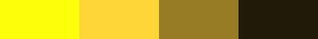
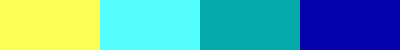

# gb-palettes

## Usage
`npm install gb-palettes`

Importing all palettes:  
`const palettes = require('gb-palettes');`  
`import palettes from 'gb-palettes';`  

Importing a subset (see categories in table below):  
`const devicePalettes = require('gb-palettes/src/devices.js');`  
`import devicePalettes from 'gb-palettes/src/devices.js';`  

Importing a single palette:  
`const gbPocketColors = require('gb-palettes/src/palettes/gbpocket.js');`  
`import gbPocketColors from 'gb-palettes/src/palettes/gbpocket.js';`  

## List of Palettes
<!-- LIST_START -->
| ShortName | Name | Preview | Categories | Origin |
|---|---|---|---|---|
| bw | Black & White |  | classic, devices |  |
| dmg | Original Game Boy |  | classic, devices |  |
| gbpocket | Game Boy Pocket |  | classic, devices |  |
| bgb | BGB Emulator |  | classic |  |
| grafixkidgray | Grafixkid Gray |  | creative |  |
| grafixkidgreen | Grafixkid Green |  | creative |  |
| blackzero | Game Boy (Black Zero) palette |  | creative |  |
| gbcjp | Game Boy Color Splash Up (PocketCamera, JP) |  | devices, gbcolor | Wikipedia |
| gbcua | Game Boy Color Splash Up+A |  | devices, gbcolor | Wikipedia |
| gbcub | Game Boy Color Splash Up+B |  | devices, gbcolor | Wikipedia |
| gbcl | Game Boy Color Splash Left |  | devices, gbcolor | Wikipedia |
| gbcla | Game Boy Color Splash Left+A |  | devices, gbcolor | Wikipedia |
| gbclb | Game Boy Color Splash Left+B |  | devices, gbcolor | Wikipedia |
| gbcd | Game Boy Color Splash Down |  | devices, gbcolor | Wikipedia |
| gbcda | Game Boy Color Splash Down+A |  | devices, gbcolor | Wikipedia |
| gbcdb | Game Boy Color Splash Down+B |  | devices, gbcolor | Wikipedia |
| gbcr | Game Boy Color Splash Right |  | devices, gbcolor | Wikipedia |
| gbceuus | Game Boy Color Splash Right+A (Game Boy Camera, EU/US) |  | devices, gbcolor | Wikipedia |
| gbcrb | Game Boy Color Splash Right+B |  | devices, gbcolor | Wikipedia |
| cybl | Cyanide Blues |  | creative | by HerrZatacke |
| aqpp | Audi Quattro Pikes Peak |  | creative |  |
| wtfp | Waterfront Plaza |  | creative |  |
| chig | Childhood in Greenland |  | creative |  |
| rcs | Rusted City Sign |  | creative |  |
| fsil | Floyd Steinberg in Love |  | creative |  |
| shzol | Space Haze Overload |  | creative |  |
| tdoyc | The death of Yung Columbus |  | creative |  |
| cfp | Caramel Fudge Paranoia |  | creative |  |
| sfh | Sunflower Holidays |  | creative |  |
| dhg | Deep Haze Green |  | creative |  |
| yirl | Youth Ikarus reloaded |  | creative |  |
| cctr | Candy Cotton Tower Raid |  | creative |  |
| d2kr | Dune 2000 remastered |  | creative |  |
| shmgy | Super Hyper Mega Gameboy |  | creative |  |
| llawk | Links late Awakening |  | creative |  |
| cga1 | CGA Palette Crush 1 |  | creative |  |
| cga2 | CGA Palette Crush 2 |  | creative |  |
| marmx | Metroid Aran remixed |  | creative |  |
| slmem | Starlit Memories |  | creative |  |
| datn | Drowning at night |  | creative |  |
| tsk | The starry knight |  | creative |  |
| ppr | Purple Rain |  | creative |  |
| cmyk | CMYKeystone |  | creative |  |
| vb85 | Virtual Boy 1985 |  | creative |  |
| azc | Azure Clouds |  | creative |  |
| gelc | Golden Elephant Curry |  | creative |  |
| roga | Romero’s Garden |  | creative | by HerrZatacke |
| kditw | Knee-Deep in the Wood |  | creative | by HerrZatacke |
| dimwm | Dies ist meine Wassermelone |  | creative | by HerrZatacke |
| spezi | My Friend from Bavaria |  | creative | by HerrZatacke |
| ffs | Flowerfeldstraße |  | creative | by HerrZatacke |
| banana | There’s always money |  | creative | by HerrZatacke |
| hipster | Artistic Caffeinated Lactose |  | creative | by HerrZatacke |
| nc | Nortorious Comandante |  | creative | by HerrZatacke |
| glmo | Glowing Mountains |  | creative | by HerrZatacke |
<!-- LIST_END -->

## contributing
Contributions of new palettes is very welcome. If you want to do so, please create a pull-request which contains:
* Addition of your palette to the importable category files.
* The new palette file itself.

### palette file structure:
``` javascript
module.exports = {
  shortName: 'gbcua',
  name: 'Game Boy Color Splash Up+A',
  palette: ['#ffffff', '#ff8f84', '#943A3A', '#000000'],
  origin: 'Wikipedia',
};
```
* Make sure your contribution matches the rules in the `.editorconfig`.
* Use singlequotes.
* Provide a `shortName` which can be used as a vaild ID in html and as a javascript object key. Also, make sure the shortName matches the filename of your palette file.
* Provide a descriptive and informational human readable `name` yor your palette* Provide the Hex-Values in lowercase with six characters.
* If possible, provide the `origin` of your palette. (source/creator/if you created it yourself, use `by YourName`).
* Before submitting your pull-request run `npm run readme` to update the table of palettes.
